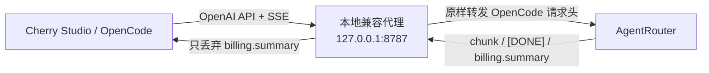

# AgentRouter OpenAI Compatibility Proxy

一个轻量、本地运行的 OpenAI 兼容代理，用于解决 AgentRouter 与 **Cherry Studio**、**OpenCode** 等客户端组合时的两个常见兼容性问题：

1. 上游在一次正常的流式响应结束后，额外发送 `object: "billing.summary"` 的 SSE 数据帧；
2. 严格遵循 OpenAI 响应 schema 的客户端把该帧当成聊天响应解析，因其中没有 `choices` 或 `error` 而报 `invalid_union`，进而中断 Agent/自动化流程。

本项目只移除该**不属于 OpenAI 聊天流协议**的账单事件，其余数据逐帧透传。尤其是，它会将 OpenCode 发出的 `Authorization`、`User-Agent`、`Accept` 等请求头**原样转发到 AgentRouter**；代理不会替换、删掉或生成这些鉴权相关头。

## 最快使用方式（Windows）

无需在终端输入 `npm start`：

1. 双击 `01-一键配置.cmd`；
2. 按提示确认 AgentRouter 地址、端口，并选择是否登录 Windows 后自动启动；
3. 配置完成后它会自动启动代理；
4. 在 OpenCode 发送一次请求，让代理捕获 OpenCode 的客户端识别头；
5. 使用 Cherry Studio。

日常操作：

| 文件 | 用途 |
| --- | --- |
| `01-一键配置.cmd` | 首次配置、修改端口或重新设置自启动 |
| `02-一键启动.cmd` | 立即在**后台隐藏启动**代理 |
| `03-检查状态.cmd` | 检查代理是否正在运行及当前端口 |
| `04-停止代理.cmd` | 停止后台代理 |

之后登录 Windows 会自动启动（如果你在向导中选择启用）。无需再手动执行 `npm start`。
后台运行不会弹出黑色窗口；启动失败或需要排查时，查看 `logs\proxy.out.log` 与 `logs\proxy.err.log`。

## 这解决了什么

你看到的错误本质上是：

```text
expected array at choices, received undefined
expected object at error, received undefined
object: "billing.summary"
```

正常的 OpenAI Chat Completions SSE 流应为一系列 `chat.completion.chunk`/`[DONE]` 事件。账单摘要并不是一个聊天 chunk；客户端完成解析后又收到它，便会将其误判为异常响应。



## 快速开始（Windows / macOS / Linux）

### 1. 前置条件

- Node.js **20 或更高版本**
- 一个仍有效的 AgentRouter API Key
- AgentRouter 控制台中显示的 OpenAI-compatible Base URL

### 2. 下载并配置

```powershell
git clone https://github.com/YOUR_ACCOUNT/agentrouter-openai-compat.git
cd agentrouter-openai-compat
.\01-一键配置.cmd
```

一键配置会生成 `.env`。`UPSTREAM_BASE_URL` 必须是完整 API 基址，包括服务商要求的路径前缀（例如 `/v1`）。

### 3. 启动

双击 `02-一键启动.cmd`。它不依赖 `npm install`，只需要 Node.js 20 或更高版本。

健康检查：

```powershell
Invoke-RestMethod http://127.0.0.1:8787/healthz
```

应返回：

```json
{"ok":true,"service":"agentrouter-openai-compat"}
```

### 4. Windows 开机/登录自动启动（只需执行一次）

```powershell
.\01-一键配置.cmd
```

在向导中选择“登录 Windows 后自动启动代理”。脚本会在当前 Windows 用户的「启动」目录中创建快捷方式。

- 立即手动启动：双击 `scripts\start-proxy.cmd`
- 取消自动启动：

  ```powershell
  npm run uninstall-startup
  ```

代理会在后台隐藏运行，不会因为误关命令窗口而停止。需要关闭时，双击 `04-停止代理.cmd`。

### 5. Cherry Studio 请求头兼容（自动）

如果你的账户被上游按客户端识别头区分，代理默认启用 Cherry Studio 兼容模式：

1. 先确保 OpenCode 的 `agentrouter-proxy` 指向本代理；
2. 用 OpenCode 发任意一条请求一次；
3. 代理会在项目根目录生成本机文件 `.opencode-header-profile.json`；
4. 之后 Cherry Studio 的请求会保留自己的 `Authorization`，但将 `User-Agent` 及其它安全的客户端识别头替换成刚捕获的 OpenCode 版本。

**没有 OpenCode 也能使用。**代理在没有捕获文件时，会自动使用内置的 OpenCode 兼容识别头；Cherry Studio 仍使用它自己的 `Authorization`。如果上游还要求某个只有特定客户端才携带的额外识别头，才需要用任一可用的兼容客户端通过本代理请求一次，以自动补全该安全头档案。

该文件不会被 Git 跟踪。日志中出现以下内容，表示已经更新为真实 OpenCode 头：

```text
INFO Captured OpenCode header profile for Cherry Studio compatibility.
```

## Cherry Studio 配置

新建一个 **OpenAI 兼容**（或 Custom OpenAI）提供商：

| 设置项 | 值 |
| --- | --- |
| API Base URL | `http://127.0.0.1:8787` |
| API Key | 原本用于 AgentRouter 的 API Key |
| 模型 | 例如 `gpt-5.5`、`gpt-5.6-sol`、`claude-opus-4.6`、`4-7`、`4-8`、`glm-5.2`、`kimi-k3` |

请选择 **设置 → 模型服务 → 添加 → 自定义服务商 → OpenAI 兼容**。在 Cherry Studio 的「API 地址」中填 `http://127.0.0.1:8787`（不要手动追加 `/v1`）；客户端会自行追加 OpenAI API 路径。代理同时兼容 Cherry Studio 生成的 `/models`、`/chat/completions` 路径和带 `/v1` 的路径，最终会正确转发到你配置的 `UPSTREAM_BASE_URL`。

如果 Cherry Studio 在保存或模型列表探测时仍提示 `unauthorized client detected`：

1. 先确认它访问的是 **`http://127.0.0.1:8787`**，而不是 AgentRouter 的 URL；
2. 确认客户端实际发送的 `Authorization` 与 `User-Agent` 没有被其自身设置覆盖；
3. 确认代理终端没有上游 `401/403` 日志；
4. 仍失败时，保留终端中的**状态码、请求路径、request-id（如有）**并联系 AgentRouter 支持。

## OpenCode 配置

在 OpenCode 中创建一个 OpenAI-compatible Provider，填入：

```text
Base URL: http://127.0.0.1:8787/v1
API key:  <原本填写给 AgentRouter 的 API Key>
```

模型名按 AgentRouter 账户可见模型填写。关键点是：**OpenCode 不再直接访问 AgentRouter**，而是访问本地代理；代理会保留 OpenCode 的全部端到端请求头并转发到 AgentRouter。这样账单 SSE 帧不会进入 OpenCode 的 OpenAI schema 校验器，Agent 流程就不会因 `billing.summary` 失败。

不同 OpenCode 版本的配置文件字段名可能不同；无论通过 UI 还是配置文件设置，目标都是上述 Base URL 和 API key。

## 工作方式与边界

### 仅丢弃什么

仅当一个完整 SSE event 的 `data:` JSON 满足以下条件时，默认丢弃：

- `object === "billing.summary"`，或
- 带有顶级 `billing` 对象，且不是 OpenAI 的 `choices` / `error` 载荷。

不会修改：

- OpenCode 的 `Authorization` / `User-Agent` / 其他端到端请求头
- `chat.completion.chunk`
- tool calls
- reasoning content
- `[DONE]`
- HTTP 状态码和普通 JSON 响应

所有丢弃仅写入本机代理日志，且不会记录 Authorization 值。

### 网络安全

- 默认只监听 `127.0.0.1`，不能从局域网访问；
- OpenCode 继续管理它原本使用的 API Key；代理不替换该请求头；
- 若将 `HOST` 改为 `0.0.0.0`，必须额外配置反向代理鉴权、TLS 和防火墙；本程序不适合直接公网暴露。

## 诊断与验证

### 查看不兼容事件是否被过滤

```powershell
$env:LOG_LEVEL = "debug"
npm start
```

正常的修复日志类似：

```text
INFO Dropped out-of-band billing.summary SSE event.
```

### 临时关闭过滤（仅诊断）

在 `.env` 中设置：

```dotenv
DROP_BILLING_SSE=false
```

重启后会完整透传上游 SSE，以便确认错误确实由账单帧导致。**不要在 OpenCode Agent 自动化中长期关闭它。**

### 测试项目本身

```powershell
npm test
```

测试使用本地模拟上游，不会使用真实 Key、不会产生任何 API 费用。

## 常见问题

### OpenCode 仍然显示 `billing.summary` 的 schema error

检查 OpenCode 的 Base URL 是否确实指向 `http://127.0.0.1:8787/v1`。如果它仍指向 AgentRouter，流量就没有经过代理。

### 返回 404

最常见原因是 `UPSTREAM_BASE_URL` 缺少或多写了版本路径。代理会将客户端的 `/v1/...` 去掉 `/v1` 后再拼接到上游基址。例如：

| `UPSTREAM_BASE_URL` | 客户端请求 | 实际上游路径 |
| --- | --- | --- |
| `https://example.com/v1` | `/v1/chat/completions` | `/v1/chat/completions` |
| `https://example.com/api/openai/v1` | `/v1/models` | `/api/openai/v1/models` |

### 遇到 `unauthorized client detected`

这是上游拒绝请求的鉴权/客户端授权响应，不是 OpenCode 的 `billing.summary` schema 问题。先确认客户端已切换到本地代理；若切换后仍出现，请更新 Key，并携带已脱敏的响应状态、时间和 request-id 联系 AgentRouter 支持。

## 开源发布清单

准备推送到 GitHub 前：

```powershell
git init
git add .
git commit -m "Initial release: AgentRouter OpenAI compatibility proxy"
```

推送前务必检查：

```powershell
git status
git grep -n -E "sk-[A-Za-z0-9_-]{20,}"
```

`.env` 不会被 Git 跟踪；只提交 `.env.example`。

## 许可证

MIT。见 [LICENSE](LICENSE)。
